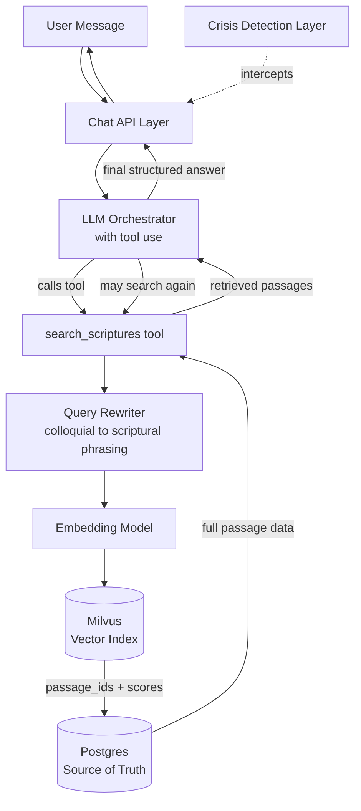
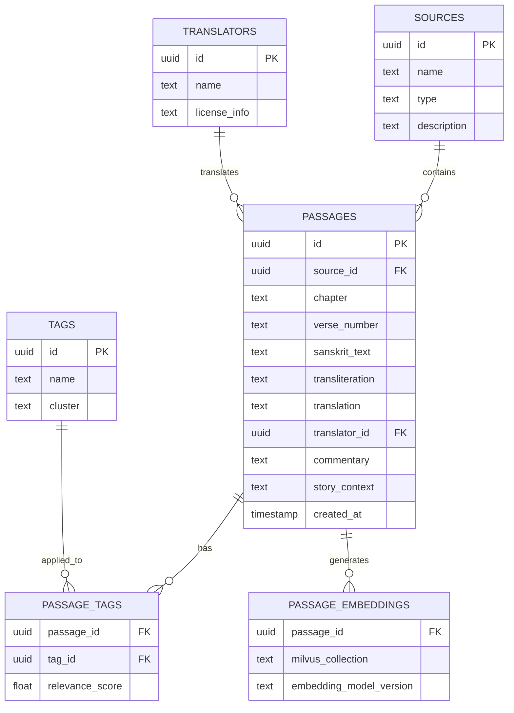
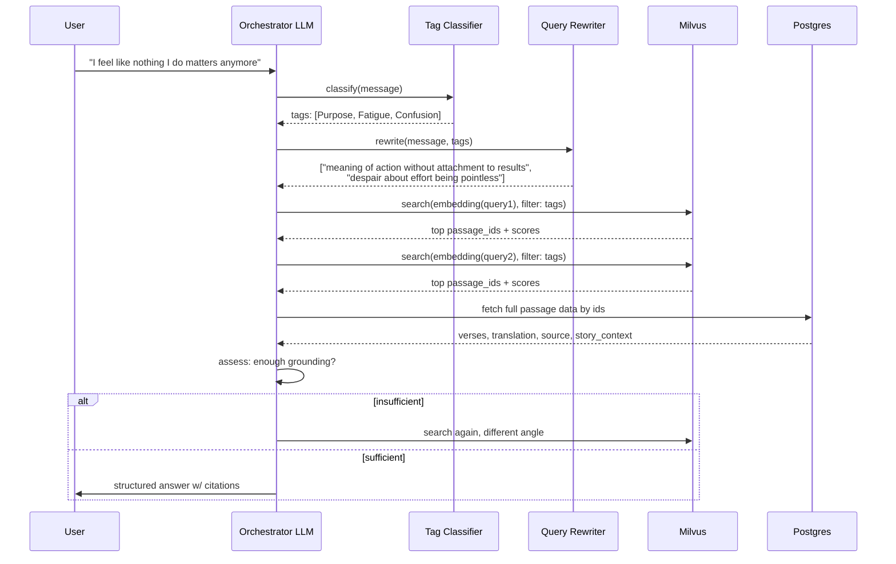

# Product Requirements Document: Scripture Wisdom Chatbot

**Version:** 1.0
**Status:** Draft
**Owner:** [Your name]
**Last updated:** 2026-09-15

---

## 1. Overview

### 1.1 Problem statement
People facing everyday struggles — anxiety, betrayal, career confusion, grief — often lack a way to connect their specific situation with the wisdom of Hindu scriptures (Bhagavad Gita, Upanishads, Ashtavakra Gita). Reading full texts is time-consuming and requires context most people don't have. There's no conversational tool that takes a personal problem, however vaguely expressed, and responds with grounded scriptural guidance — verse, source, and explanation — rather than generic self-help text.

### 1.2 Product summary
A chatbot that accepts free-form descriptions of personal problems and responds with spiritually grounded guidance sourced from Hindu scriptures. Every answer must cite the actual verse/story it draws from (chapter, verse number, source text) — no answer should be generated purely from the LLM's own training knowledge.

### 1.3 Target audience
Hindu users seeking spiritual perspective on life problems. Voice and framing assume this audience explicitly (e.g., "Krishna teaches...", "Lord Krishna says..."), rather than a secularized or interfaith tone.

### 1.4 Goals / non-goals

**Goals**
- Accurate retrieval grounded in real scripture passages, never hallucinated verses
- Handle vague, incomplete, or emotionally-worded queries gracefully
- Always cite source (text, chapter, verse, translator)
- Structured, warm, non-clinical responses
- Support multi-turn conversation (follow-ups, clarification)

**Non-goals (v1)**
- Not a replacement for therapy or crisis support — must detect and redirect crisis-level messages
- Not multi-faith / not attempting to generalize across religions
- Not doing verse-by-verse full-text reading/study mode (that's a different product)
- No user accounts / long-term memory across sessions in v1 (stateless per session)

---

## 2. Success metrics

| Metric | Target (v1 launch) |
|---|---|
| % answers with valid, correctly-cited verse | 100% (any answer without a grounded citation is a failure) |
| Retrieval relevance (human eval, 1-5 scale) | ≥ 4.0 average across test query set |
| Crisis-message detection recall | 100% on test set (see §8) |
| p95 response latency | < 6s |
| Session completion (user doesn't abandon mid-query) | ≥ 80% |

---

## 3. User stories

1. *As a user going through a divorce*, I want to describe my situation in my own words and get scripture-backed perspective on attachment and letting go, so I feel understood rather than judged.
2. *As a user who is vague* ("I don't know what to do anymore"), I want the bot to still give a meaningful answer or ask one gentle clarifying question, rather than a generic non-answer.
3. *As a user*, I want every response to show me exactly which verse and source it's quoting, so I can trust it's not making things up and can go read more myself.
4. *As a user in genuine crisis*, I want the bot to recognize this and point me to real help rather than just quoting scripture at me.

---

## 4. System architecture



### 4.1 Component responsibilities

| Component | Responsibility |
|---|---|
| Chat API Layer | Session handling, request/response, rate limiting |
| Crisis Detection Layer | Runs before/alongside main flow; intercepts self-harm/crisis signals |
| LLM Orchestrator | Decides when to search, how many times, and synthesizes final answer |
| Query Rewriter | Converts casual/emotional language into scripture-adjacent search phrasing |
| Embedding Model | Converts rewritten queries into vectors |
| Milvus | Vector similarity search with scalar (tag) filtering |
| Postgres | Source of truth for passage text, metadata, tags, translators |

---

## 5. Data model

### 5.1 Entity relationship diagram



### 5.2 Postgres schema (DDL)

```sql
CREATE TABLE sources (
    id UUID PRIMARY KEY DEFAULT gen_random_uuid(),
    name TEXT NOT NULL,              -- 'Bhagavad Gita', 'Isha Upanishad'
    type TEXT NOT NULL,              -- 'Gita', 'Upanishad', 'Itihasa'
    description TEXT
);

CREATE TABLE translators (
    id UUID PRIMARY KEY DEFAULT gen_random_uuid(),
    name TEXT NOT NULL,
    license_info TEXT                -- public domain / licensed / attribution required
);

CREATE TABLE passages (
    id UUID PRIMARY KEY DEFAULT gen_random_uuid(),
    source_id UUID REFERENCES sources(id),
    chapter TEXT,
    verse_number TEXT,                -- e.g. '2.47'
    sanskrit_text TEXT,
    transliteration TEXT,
    translation TEXT NOT NULL,
    translator_id UUID REFERENCES translators(id),
    commentary TEXT,
    story_context TEXT,               -- surrounding narrative, if any
    created_at TIMESTAMP DEFAULT now()
);

CREATE TABLE tags (
    id UUID PRIMARY KEY DEFAULT gen_random_uuid(),
    name TEXT NOT NULL UNIQUE,        -- 'Greed', 'Anxiety', 'Betrayal'
    cluster TEXT NOT NULL             -- 'Money', 'Mind', 'Relationships' (UI grouping only)
);

CREATE TABLE passage_tags (
    passage_id UUID REFERENCES passages(id),
    tag_id UUID REFERENCES tags(id),
    relevance_score FLOAT DEFAULT 1.0,
    PRIMARY KEY (passage_id, tag_id)
);

CREATE TABLE passage_embeddings (
    passage_id UUID REFERENCES passages(id) PRIMARY KEY,
    milvus_collection TEXT NOT NULL,
    embedding_model_version TEXT NOT NULL,
    indexed_at TIMESTAMP DEFAULT now()
);

CREATE TABLE conversations (
    id UUID PRIMARY KEY DEFAULT gen_random_uuid(),
    session_id TEXT NOT NULL,
    created_at TIMESTAMP DEFAULT now()
);

CREATE TABLE messages (
    id UUID PRIMARY KEY DEFAULT gen_random_uuid(),
    conversation_id UUID REFERENCES conversations(id),
    role TEXT NOT NULL,               -- 'user' | 'assistant'
    content TEXT NOT NULL,
    cited_passage_ids UUID[],         -- passages referenced in this answer
    created_at TIMESTAMP DEFAULT now()
);

CREATE INDEX idx_passage_tags_tag ON passage_tags(tag_id);
CREATE INDEX idx_passages_source ON passages(source_id);
```

### 5.3 Milvus collection schema

```python
from pymilvus import CollectionSchema, FieldSchema, DataType

fields = [
    FieldSchema(name="id", dtype=DataType.VARCHAR, max_length=36, is_primary=True),
    FieldSchema(name="passage_id", dtype=DataType.VARCHAR, max_length=36),
    FieldSchema(name="embedding", dtype=DataType.FLOAT_VECTOR, dim=1536),
    FieldSchema(name="source_name", dtype=DataType.VARCHAR, max_length=100),
    FieldSchema(name="tag_ids", dtype=DataType.ARRAY, element_type=DataType.VARCHAR,
                max_length=36, max_capacity=10),
]

schema = CollectionSchema(fields, description="Scripture passage embeddings")

# Index config
index_params = {
    "metric_type": "COSINE",
    "index_type": "HNSW",
    "params": {"M": 16, "efConstruction": 200}
}
```

Notes:
- `tag_ids` array enables scalar filtering alongside vector search (e.g. `tag_ids in [...]`) to boost/restrict results to the classified topic before ranking.
- Only minimal metadata is duplicated into Milvus (source name, tags) for filtering; full text is always fetched from Postgres by `passage_id` after retrieval — Milvus is never the source of truth.

---

## 6. Retrieval pipeline



### 6.1 Query rewriting examples

| User's raw message | Rewritten search queries |
|---|---|
| "I feel like nothing I do matters anymore" | "meaning of action without attachment to results"; "purpose of duty despite despair" |
| "My partner cheated on me and I can't let go of the anger" | "betrayal and forgiveness"; "attachment causing suffering"; "controlling anger and reaction" |
| "I got passed over for a promotion I deserved" | "injustice and detachment from outcomes"; "ego and recognition"; "karma without expectation of reward" |
| "I don't know who I even am anymore" | "nature of the true self"; "atman vs body identification"; "identity beyond roles" |

---

## 7. Response format

Every answer follows a fixed structure so citation and tone stay consistent.

**Template:**
1. **Acknowledgment** — brief, warm, non-clinical reflection of their situation
2. **Core teaching** — 1-2 plain-language sentences
3. **Verse citation** — Sanskrit/transliteration (optional) + translation + exact reference
4. **Explanation** — how the verse connects to their specific situation
5. **Gentle takeaway** — optional, only if it doesn't feel like generic advice

### 7.1 Example interaction

> **User:** "I've been working so hard for this promotion for two years and someone else got it. I feel like all that effort was pointless."

> **Bot:**
>
> That kind of disappointment is heavy — putting in real effort and watching the outcome go elsewhere can feel like a betrayal of your own hard work.
>
> Krishna speaks directly to this in the Bhagavad Gita. He teaches that our right is to the effort itself, never to the fruit of that effort:
>
> *"You have a right to perform your prescribed du航duty, but you are not entitled to the fruits of your actions. Never consider yourself the cause of the results of your activities, and never be attached to not doing your duty."*
> — **Bhagavad Gita 2.47** (trans. A.C. Bhaktivedanta Swami Prabhupada)
>
> This isn't Krishna telling Arjuna not to care — it's a reframe: your effort, discipline, and integrity over those two years were never wasted, because their value was in the doing, not in the promotion itself. The outcome was never fully within your control to begin with.
>
> The invitation here isn't to stop striving, but to notice: can you find the same steadiness in your work, whether or not this particular reward comes?

*(Response includes a "Read more" link to the full verse/chapter if the user wants to go deeper.)*

### 7.2 Example: vague input handling

> **User:** "I don't know what to do anymore"

> **Bot:**
>
> That sounds like a heavy place to be sitting in. Before I share something, I want to make sure I understand — is this more about a loss or grief you're carrying, or a decision you're stuck between?

*(Only asked because "confusion" here could branch into genuinely different scriptural themes — grief/impermanence vs. discernment/duty. If the message had leaned clearly one way, the bot would answer directly instead of asking.)*

---

## 8. Crisis detection

A lightweight classifier (or rules + LLM check) runs on every incoming message **before** the main scripture-search flow.

- If flagged: bot does not attempt scripture-based comfort as a substitute for help. It responds with care and directs to real crisis resources, and does not proceed to quote scripture as if it resolves the situation.
- This layer takes priority over everything else in the pipeline — no exceptions, no "spiritual bypass" of a real crisis signal.
- Test set of at least 50 crisis-adjacent phrasings (direct and indirect) should be maintained and checked before each deploy.

---

## 9. Content pipeline (populating the database)


- **Chunking**: one passage = one citable unit (a verse, or a short story segment). Avoid chunking mid-story where context would be lost.
- **Tagging**: can be LLM-assisted (suggest tags) but must be human-reviewed given the sensitivity of misrepresenting scripture.
- **Human review is mandatory** before any passage goes live — this is the highest-risk step for misquoting or misinterpreting theology.

---

## 10. Open questions

1. Which specific translations do we have rights/license to use for each text? (Needs legal check per source.)
2. Do we allow follow-up conversation memory within a session, or treat each message independently?
3. Should users be able to browse by category directly (not just chat), using the tag clusters as navigation?
4. What's the escalation path if a user pushes back on or disputes an interpretation given?

---

## 11. Rollout plan (high-level)

| Phase | Scope |
|---|---|
| Phase 0 | Bhagavad Gita only, ~50 tagged passages, internal testing |
| Phase 1 | Add Upanishads + Ashtavakra Gita, expand tag coverage, closed beta |
| Phase 2 | Public launch, crisis detection hardened, feedback loop on citation accuracy |
| Phase 3 | Category browsing UI, saved sessions, multi-turn memory |
